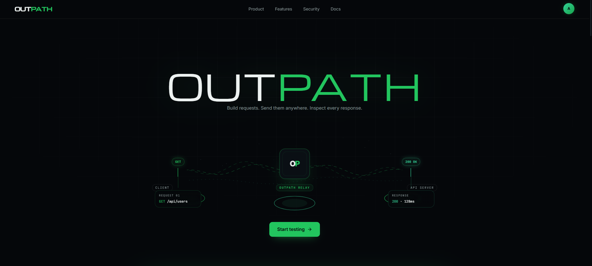
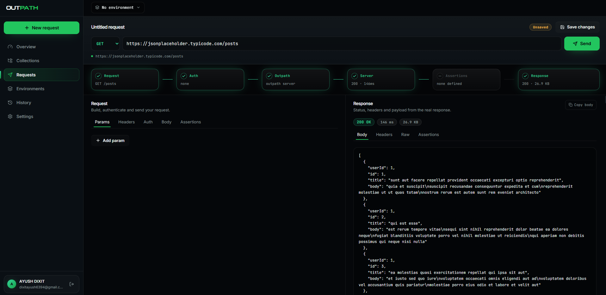

<div align="center">

# OUT<span style="color:#22C55E">PATH</span>

**Build requests. Send them anywhere. Inspect every response.**

A web-first API testing workspace with collections, environments, assertions and history, where local/private targets hit your machine straight from the browser.


</div>

<br />

<p align="center">
  
</p>

<p align="center">
  
</p>

## What is Outpath

Outpath is an API client in the spirit of Postman or Thunder Client, built to run entirely in the browser. Requests to public APIs are relayed through the hosted FastAPI backend; requests to `localhost` or a private LAN target are sent **directly from the browser** using Chrome's Local Network Access (LNA), so nothing you test on your own machine ever has to leave it.

## Features

- **Request builder**: params, headers, auth, and body editing with a live, syntax-highlighted response pane (status, timing, size, headers, raw).
- **Collections**: organize saved requests into folders you can reopen, edit and re-send.
- **Environments**: swap variable sets (`{{base_url}}`, tokens, etc.) per environment without touching a request.
- **Assertions**: attach pass/fail checks to a request and see them evaluated against the real response.
- **History**: every send is logged with method, status, duration and size, searchable and replayable.
- **Overview dashboard**: request/send counts, success rate, latency range, a 7-day traffic chart with a latency overlay, and method/status-code breakdowns at a glance.
- **Local Network Access**: send requests to `127.0.0.1` or a private IP straight from the browser tab, permissioned by Chrome, no extension or tunnel required.
- **AI error hints** *(optional)*: when `GROQ_API_KEY` is set, failed requests get a short diagnosis of what likely went wrong.

## Tech stack

| Layer      | Choice |
| ---------- | ------ |
| Frontend   | React + Vite, Tailwind CSS, Framer Motion |
| Backend    | FastAPI, SQLAlchemy, Alembic |
| Database   | PostgreSQL (Neon) |
| Local reach | Browser Local Network Access (Chrome 142+) |
| Auth       | Google OAuth / session |

## Architecture

```text
┌──────────┐      request       ┌──────────────┐      forwarded       ┌─────────────┐
│  Client  │ ──────────────────▶│ Outpath Relay │ ────────────────────▶│  API server  │
│ (browser)│◀────────────────── │   (FastAPI)   │◀──────────────────── │ (public host) │
└──────────┘      response      └──────────────┘        response       └─────────────┘

┌──────────┐   direct via LNA   ┌─────────────────────────┐
│  Client  │ ──────────────────▶│ localhost / private LAN   │
│ (browser)│◀────────────────── │        target             │
└──────────┘      response      └─────────────────────────┘
```

Public targets go **client → relay → server**, measured and verified end to end. Local and private targets skip the relay entirely and go straight from the tab to your machine, using the browser's `targetAddressSpace` (`loopback` for `localhost`/`127.0.0.1`, `local` for LAN IPs).

## Quick start

### Backend

```powershell
cd backend
python -m venv venv
.\venv\Scripts\Activate.ps1
pip install -r requirements.txt
uvicorn app.main:app --reload
```

### Frontend

```powershell
cd frontend
npm install
npm run dev
```

Open the Vite app at `http://localhost:5173`.

### Environment variables

| Variable | Where | Purpose |
| --- | --- | --- |
| `ALLOWED_ORIGINS` | backend | JSON list of frontend origins allowed through CORS |
| `GROQ_API_KEY` | backend | enables AI error-hint diagnosis on failed sends |
| `GROQ_MODEL` | backend | defaults to `openai/gpt-oss-120b` |

## Local API testing (Local Network Access)

There is no Chrome extension, Web Store listing, tunnel, or local installer in this build. Local testing works through the browser's own LNA permission.

```text
https://outpath.vercel.app
        │
        │ browser fetch + Local Network Access permission
        ▼
http://127.0.0.1:8000
        │
        ▼
local/private API
```

`localhost`/`127.0.0.1` requests are sent as the `loopback` address space; private LAN destinations (e.g. `192.168.x.x`) are sent as `local`. The Outpath page must be served over HTTPS for Chrome to grant the permission. On a supported Chrome build (LNA shipped in stable at Chrome 142, with the **Apps on device** / **Local Network** prompts refined in 145+), the first private/LAN request triggers a one-time permission prompt. Allow it and resend. If Chrome has already blocked the permission, open the site information icon → **Site settings** and allow the local-device/network permission, then reload Outpath.

### Target API CORS

A local API must allow the Outpath origin, and must echo `Access-Control-Allow-Private-Network: true` when Chrome sends `Access-Control-Request-Private-Network: true`.

```python
from fastapi.middleware.cors import CORSMiddleware

app.add_middleware(
    CORSMiddleware,
    allow_origins=[
        "https://outpath.vercel.app",
        "http://localhost:5173",
        "http://127.0.0.1:5173",
    ],
    allow_credentials=False,
    allow_methods=["*"],
    allow_headers=["*"],
)
```

If the target API doesn't send CORS headers, the browser blocks the response even with LNA permission granted. That's a browser security rule this web-only build intentionally doesn't bypass.

### Try it against the bundled example API

```powershell
cd examples\local-api
python -m venv venv
.\venv\Scripts\Activate.ps1
pip install -r requirements.txt
uvicorn main:app --host 127.0.0.1 --port 8000
```

Then in Outpath:

```text
GET  http://127.0.0.1:8000/api/test
POST http://127.0.0.1:8000/api/echo
```

POST body:

```json
{
  "name": "Outpath",
  "value": 100
}
```

## Production

The Vercel-hosted frontend uses an `/api/*` rewrite to the Render-hosted backend. Set `ALLOWED_ORIGINS` on the backend to the exact deployed frontend origin(s), for example:

```env
ALLOWED_ORIGINS=["https://outpath.vercel.app"]
```

Google authentication runs on the existing OAuth/session flow, with no extra setup beyond the standard OAuth credentials.
